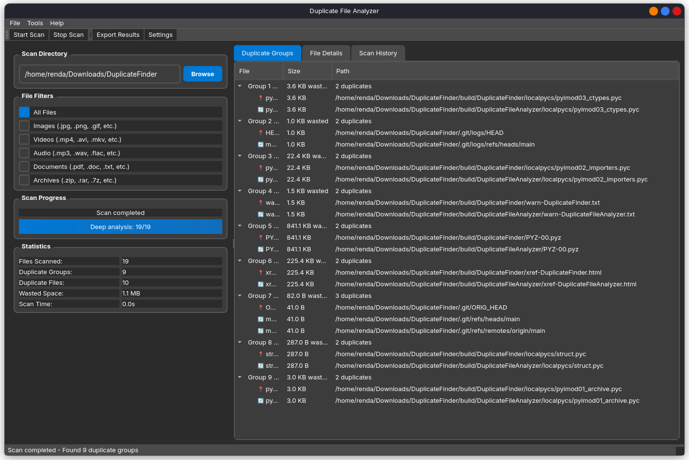

# Duplicate File Analyzer

<div align="center">
  
</div>

A modern, professional desktop application for finding and managing duplicate files on your computer. Clean up your storage space by identifying files with identical content, regardless of their names or locations.


## 📸 Application Preview

<div align="center">
  
  <p><em>Clean, modern interface with real-time progress tracking and organized results</em></p>
</div>

## ✨ Features

### 🎯 Smart Duplicate Detection

- **Content-based analysis** - Finds duplicates by comparing actual file content, not just names
- **Lightning fast scanning** - Uses intelligent multi-stage filtering to handle terabytes of data efficiently
- **Accurate results** - Three-stage progressive analysis ensures precise duplicate detection

### 🖥️ Modern Interface

- **Beautiful, intuitive design** - Clean, professional interface that's easy to use
- **Real-time progress tracking** - Watch your scan progress with detailed status updates
- **Tabbed organization** - Organized views for duplicate groups, file details, and scan history

### 🎛️ Flexible Filtering

- **File type filters** - Focus on specific types: Images, Videos, Audio, Documents, Archives
- **Custom directory selection** - Scan any folder or drive on your system
- **Smart exclusions** - Automatically skips system files and empty files

### 📊 Comprehensive Results

- **Visual duplicate groups** - See all duplicates organized in easy-to-browse groups
- **Detailed file information** - View file sizes, paths, and modification dates
- **Wasted space calculation** - Know exactly how much storage you can recover
- **Export capabilities** - Save results in multiple formats (JSON, CSV, Text)

### 🚀 Performance Optimized

- **Handles massive datasets** - Efficiently processes terabytes of data
- **Non-blocking interface** - UI remains responsive during long scans
- **Cancellable operations** - Stop scans at any time
- **Memory efficient** - Optimized for large file collections

## 🚀 Quick Start

### Installation Requirements

Make sure you have Python 3.8 or higher installed, then install the required dependencies:

```bash
pip install -r requirements.txt
```

### Running the Application

Simply run the main script:

```bash
python main.py
```

## 🎮 How to Use

### Scanning for Duplicates

1. Launch the application
2. Click "Browse" to select the directory you want to scan
3. Optionally check file type filters to focus on specific types of files
4. Click "Start Scan" in the toolbar
5. Watch the progress bar as the application analyzes your files

### Understanding Results

- **Duplicate Groups**: Files with identical content are grouped together
- **Original vs Duplicates**: The first file in each group is considered the "original"
- **Wasted Space**: Shows how much storage space you could recover
- **File Details**: Click on any file to see detailed information

### Managing Duplicates

- **Right-click context menu**: Access file operations like delete, show in folder, etc.
- **Export results**: Save your scan results for later reference
- **Selective deletion**: Choose which duplicates to keep and which to remove

### File Type Filters

- **Images**: JPG, PNG, GIF, BMP, TIFF, and more
- **Videos**: MP4, AVI, MKV, MOV, WMV, and more  
- **Audio**: MP3, WAV, FLAC, AAC, OGG, and more
- **Documents**: PDF, DOC, TXT, XLS, PPT, and more
- **Archives**: ZIP, RAR, 7Z, TAR, GZ, and more

## 💡 Tips for Best Results

### For Large Datasets

- Start with file type filters to focus your scan
- Consider scanning smaller directories first to get familiar with the interface

### Before Deleting Files

- Always review the duplicate groups carefully
- Keep the original file (usually the first one in each group)
- Consider backing up important files before deletion
- Use the "Show in Folder" option to verify file locations

### Performance Optimization

- Close other resource-intensive applications during scanning
- For external drives, ensure stable USB/connection
- The application automatically optimizes performance based on your system

## 🔧 Settings & Customization

Access the Settings dialog to customize:

- **Performance settings**: Adjust chunk sizes for optimal speed
- **Interface preferences**: Choose between light/dark themes
- **Auto-save options**: Automatically save scan results

## 📁 Supported File Systems

The application works with all major file systems:

- **Windows**: NTFS, FAT32, exFAT
- **macOS**: APFS, HFS+
- **Linux**: ext4, ext3, XFS, Btrfs

## 🆘 Troubleshooting

### Common Issues

- **Slow scanning**: Try using file type filters to reduce the scope
- **Application not responding**: Large scans can take time - check the progress bar
- **Permission errors**: Run as administrator/sudo for system directories
- **Out of memory**: Scan smaller directories or restart the application

### Getting Help

If you encounter any issues:

1. Check that you have sufficient permissions for the directories you're scanning
2. Ensure you have enough free RAM for large scan operations
3. Try scanning a smaller test directory first
4. Restart the application if it becomes unresponsive

---

**Author**: @rendayigit  
**Platform**: Cross-platform (Windows, macOS, Linux)

*Efficiently find and manage duplicate files with a beautiful, modern interface.*
